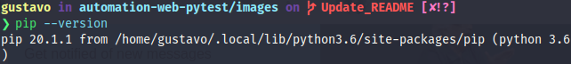
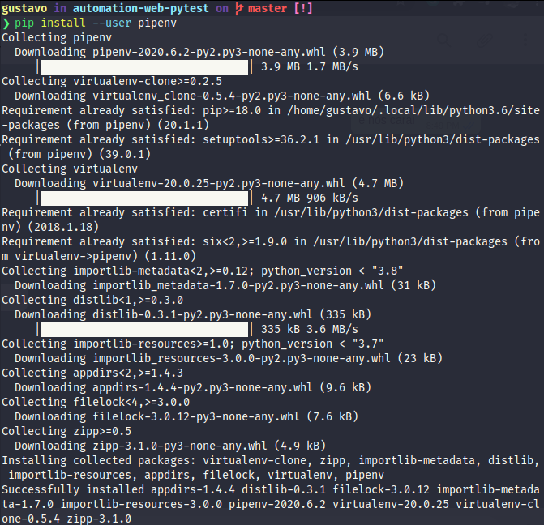
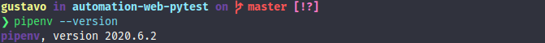
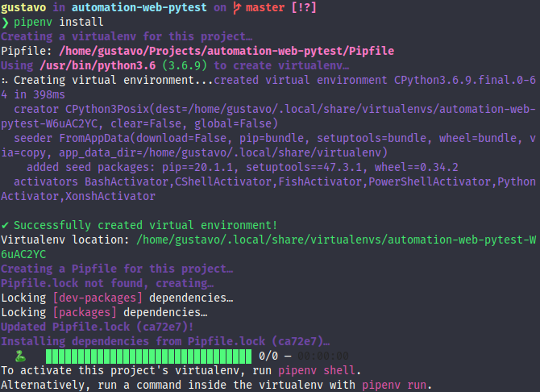
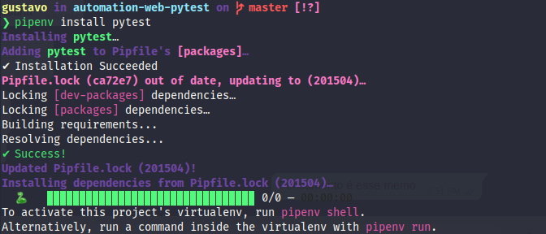
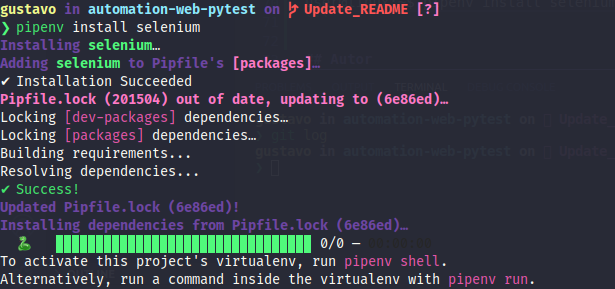

# Automação Selenium - Python - Pytest

[](https://opensource.org/licenses/MIT)

Estudo de automação de testes de aceitação (end-to-end) no site The-Internet, utilizando Selenium WebDriver e Pytest Framework.

O projeto foi estruturado utilizando o padrão de projetos Page Object Model (POM).

## Setup

### Instalação

Será necessário fazer a instalação de algumas ferramentas.

### pipenv

Utilizando o gerenciador de pacotes pip, podemos instalar o ambiente virtual do Python.

É importante garantir que o pip esteja instalado corretamente

```console
user@linux:~$ pip --version
```



Para instalar o pipenv

```console
user@linux:~$ pip install --user pipenv
```



É possível checar a versão do pipenv

```console
user@linux:~$ pipenv --version
```



Com o ambiente virtual instalado, basta iniciar o pipenv

```console
user@linux:~$ pipenv install
```



Após a execução do comando, deverão ser criados os arquivos de configuração **Pipfile** e **Pipfile.lock**.

### pytest

Com o ambiente virtual instalado e devidamente configurado, podemos instalar o framework que será utilizado para a execução dos testes, o pytest.

O comando irá instalar o pytest apenas no ambiente virtual

```console
user@linux:~$ pipenv install pytest
```



### Selenium WebDriver

O selenium poderá ser instalado dentro do próprio ambiente virtual utilizado durante este setup

```console
user@linux:~$ pipenv install selenium
```



## Recursos

* [the-internet](https://the-internet.herokuapp.com/)
* [pytest](https://docs.pytest.org/en/latest/)
* [Selenium-Python](https://selenium-python.readthedocs.io/)
* [Page Object](https://martinfowler.com/bliki/PageObject.html)

## Autor

[Gustavo Dias A.](https://www.linkedin.com/in/gustavo-dias-alexandre-543568157/)

## License

Este projeto está sob a licença [MIT](LICENSE).
